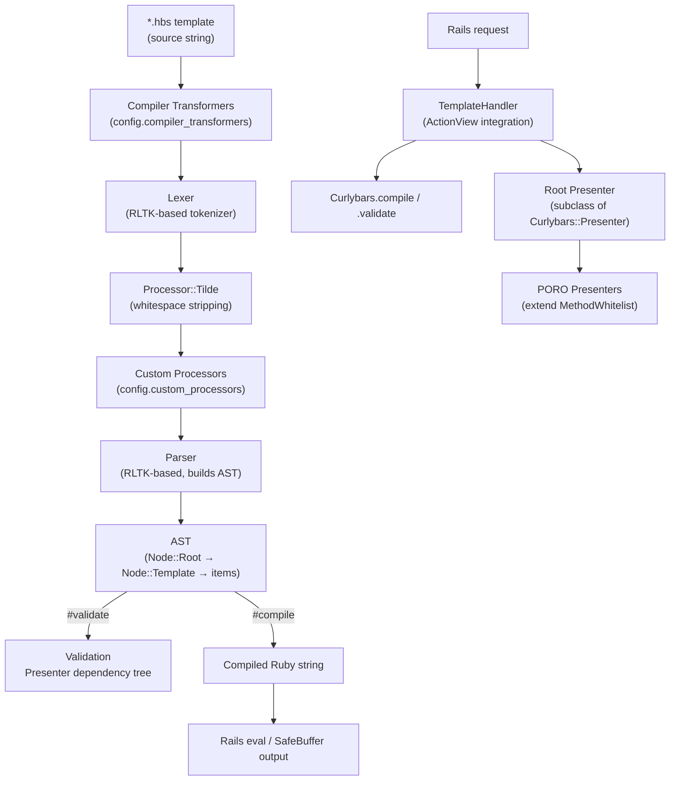

# Curlybars — Architecture

## System Overview

Curlybars is a Rails-integrated Ruby gem that compiles Handlebars-flavored `.hbs` templates into Ruby code at request time. Templates are validated against a presenter's declared method whitelist before rendering, providing a security boundary between template authors and the Ruby runtime. The gem integrates into Rails via a Railtie that registers the `.hbs` template handler and a dependency tracker for the asset pipeline.

## Architecture Diagram

## Component Map

| Path | Responsibility |
|------|---------------|
| `lib/curlybars.rb` | Public API: `compile`, `validate`, `valid?`, `visit`, `find`; bootstraps pipeline |
| `lib/curlybars/lexer.rb` | Tokenizes HBS source using RLTK; state machine for `{{`, `}}`, comments, tilde |
| `lib/curlybars/parser.rb` | Builds AST from token stream using RLTK grammar productions |
| `lib/curlybars/node/` | One file per AST node type; each node implements `#compile` and `#validate` |
| `lib/curlybars/processor/` | Token-level transforms before parsing (`Tilde`, custom processors) |
| `lib/curlybars/rendering_support.rb` | Runtime helper: context stack, variable resolution, timeout enforcement, caching |
| `lib/curlybars/template_handler.rb` | Rails `ActionView::Template` handler; resolves presenter, calls `compile`, wraps in cache |
| `lib/curlybars/presenter.rb` | Base class for root presenters; handles `presents`, caching keys, setup lifecycle |
| `lib/curlybars/method_whitelist.rb` | Module providing `allow_methods` DSL; generates `dependency_tree` for validation |
| `lib/curlybars/generic.rb` | Marker type for dynamically-typed helper return values |
| `lib/curlybars/partial_presenter.rb` | Presenter wrapper for `{{> partial}}` resolution |
| `lib/curlybars/path_finder.rb` | AST walker for finding path nodes by target path and syntactic role |
| `lib/curlybars/visitor.rb` | Base visitor class for AST traversal |
| `lib/curlybars/configuration.rb` | Runtime configuration: limits, processors, global helpers, cache, partial provider |
| `lib/curlybars/railtie.rb` | Rails integration: registers `.hbs` handler and dependency tracker |
| `lib/curlybars/error/` | Error hierarchy rooted at `Error::Base`; typed errors for lex/parse/compile/validate/render |
| `lib/curlybars/validation_context.rb` | Carries partial resolver and call-site metadata during validation |
| `spec/curlybars/` | Unit tests mirroring `lib/curlybars/` |
| `spec/acceptance/` | Acceptance tests for template language features |
| `spec/integration/` | Full-stack integration tests using the `spec/dummy/` Rails app |
| `docs/` | User-facing documentation (templates, presenters, helpers, configuration, errors) |
| `gemfiles/` | Per-Rails-version Bundler gemfiles for CI matrix (`rails7.2`, `rails8.0`, `rails8.1`, `rails_main`) |

## Compilation Pipeline

1. **Transformer pass** — `config.compiler_transformers` rewrite the raw HBS source string before tokenization
2. **Lexer** — `Curlybars::Lexer` tokenizes the source (RLTK state machine; handles comments, tilde whitespace control, variables `@var`, paths, literals)
3. **Token processors** — `Processor::Tilde` strips adjacent whitespace tokens; custom processors from `config.custom_processors` run in order
4. **Parser** — `Curlybars::Parser` (RLTK grammar) produces an AST rooted at `Node::Root`
5. **Validate** — `ast.validate(branches, context:)` walks the tree against the presenter's `dependency_tree`; returns an array of `Error::Validate` (empty = valid)
6. **Compile** — `ast.compile` emits a Ruby string; `Curlybars.compile` caches the result keyed by `[VERSION, identifier, SHA256(source)]`
7. **Render** — the compiled Ruby string is `eval`'d inside the ActionView context, writing to `@output_buffer` via `RenderingSupport`

## Key Design Decisions

### Presenter Method Whitelist as Security Boundary
Templates can only access methods explicitly declared via `allow_methods`. This prevents template authors from calling arbitrary Ruby. The whitelist also drives the `dependency_tree` used for static validation, so security and correctness share one source of truth.

### Two-Phase Operation: Validate then Compile
Curlybars separates validation (checking template correctness against a presenter schema) from compilation (generating Ruby). Validation can be run at deploy-time or in tests without executing the template.

### RLTK-Based Lexer and Parser
The lexer and parser use the RLTK gem for formal grammar definitions. This makes the language specification explicit and maintainable rather than ad-hoc regex.

### Rails Railtie Integration
The gem auto-registers itself with Rails by loading `Curlybars::Railtie` when `Rails` is defined. No manual setup is required beyond adding the gem to the `Gemfile`.

### Compilation Caching
`Curlybars.compile` caches compiled Ruby code in `Rails.cache` (set by the Railtie) keyed by gem version, template identifier, and source hash. This avoids re-parsing on every request.

### Runtime Safety Limits
`RenderingSupport` enforces `rendering_timeout` and the `output_limit` is checked during rendering. These prevent runaway templates from consuming unbounded resources.

## External Dependencies

| Dependency | Purpose | Declared In |
|------------|---------|-------------|
| `rltk` | Lexer and parser framework | `curlybars.gemspec` |
| `actionpack` / `activesupport` | Rails integration, SafeBuffer, notifications | `curlybars.gemspec` |
| `ffi` | Required by rltk for native extensions | `curlybars.gemspec` |
| RubyGems.org | Distribution channel | Released via `publish.yml` workflow |

## Cross-Cutting Concerns

### Configuration
Access via `Curlybars.configure { |c| c.option = value }` in a Rails initializer. See `docs/configuration.md` for all options.

### Observability
Template compilation fires `ActiveSupport::Notifications` `compile.curlybars` events with `{ path: }` payload. Subscribe in an initializer for custom metrics.

### Error Handling
All errors are subclasses of `Curlybars::Error::Base` with a typed `id` string and optional `position` (file, line, offset). Render-time errors include `timeout` and context-type errors. Lex/parse errors wrap RLTK exceptions.
